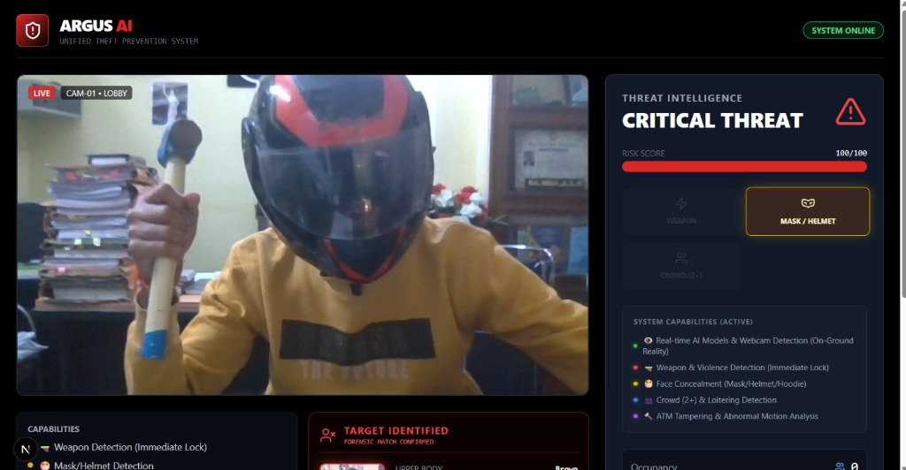
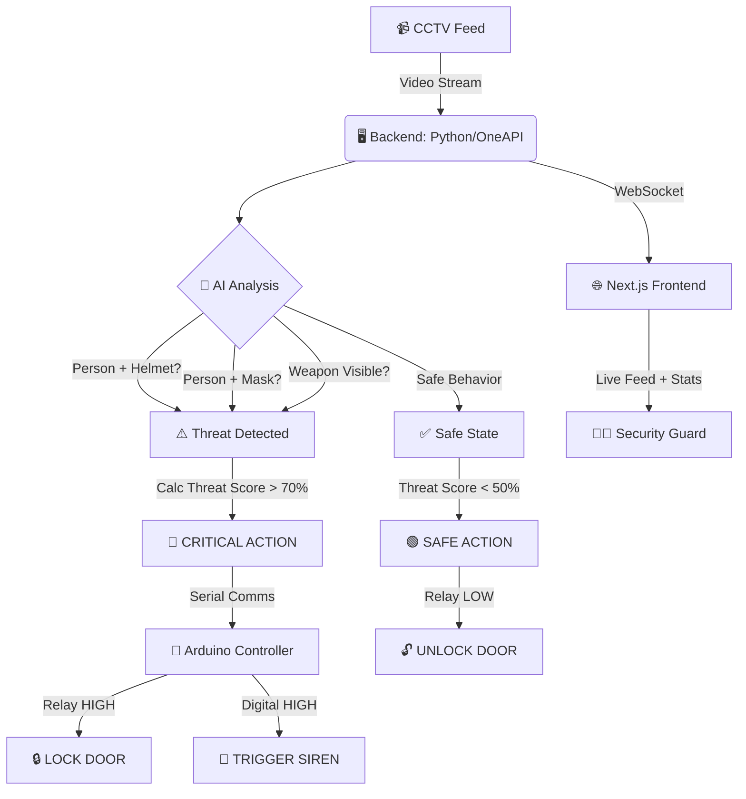
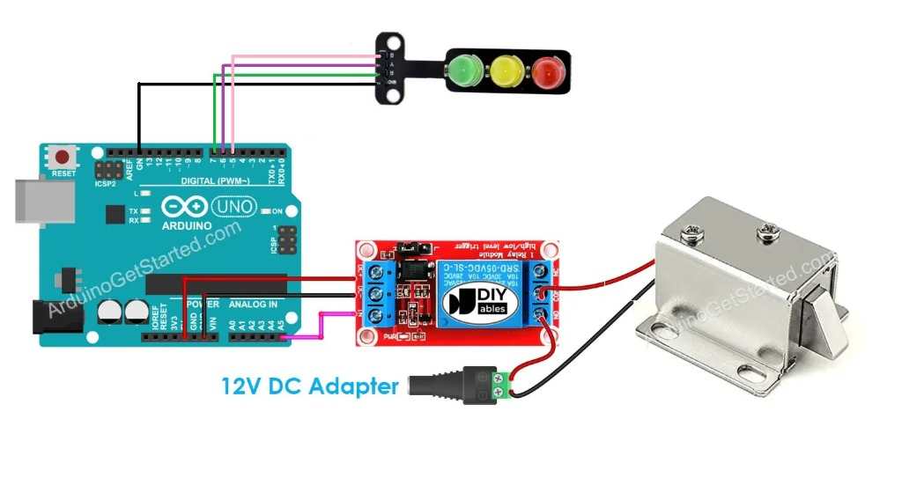

# 🛡️ **ARGUS: AI-Powered Autonomous ATM Security System** 👁️
> *The All-Seeing Eye for Next-Gen Banking Security*

[](https://python.org)
[](https://nextjs.org/)
[](https://ultralytics.com)
[](https://arduino.cc)
[](LICENSE)

---

## 🚨 **The Problem**
ATM theft, robberies, and vandalism are rising. Traditional CCTV is **passive**—it only records the crime. Security guards are expensive and prone to human error.
**We need a system that ACTS before the crime happens.**

## 💡 **The Solution: ARGUS**
**ARGUS** (Automated Real-time Guard & Unlocking System) is an intelligent defense layer for ATMs. It uses multi-model Computer Vision to detect threats in real-time (`Masks`, `Helmets`, `Weapons`, `Crowds`) and takes immediate physical action: **Locking the Door** and **Sounding the Siren**.



---

## 🌟 **Key Features**

| Feature | Description | Status |
| :--- | :--- | :---: |
| 🧠 **Multi-Threaded AI** | Runs **5+ AI Models** simultaneously for comprehensive threat detection. | ✅ |
| 🔒 **Auto-Lock Mechanism** | Instantly triggers an electromagnetic lock via **Arduino** when threat > 70%. | ✅ |
| 🔊 **Smart Siren Logic** | Blaring alarm + Text-to-Speech warnings ("Siren Activated") to deter intruders. | ✅ |
| 😷 **Face/Mask Compliance** | Detects masked faces (MobileNetV2) and helmets (YOLOv8) to enforce "Face Visible" rules. | ✅ |
| 🗡️ **Weapon Detection** | Custom trained models to spot **Guns**, **Knives**, and aggressive tools. | ✅ |
| 🌙 **Late Night Protocol** | Stricter security rules activated automatically during high-risk hours (10 PM - 5 AM). | ✅ |
| 💻 **Cyberpunk Console** | A futuristic **Next.js Dashboard** for guards to monitor live feeds & control hardware. | ✅ |

---

## 🏗️ **System Workflow (Flowchart)**



---

## 🤖 **AI Model Warehouse**
We don't just use one model. We use an ensemble of specialized neural networks.

| Model / Architecture | Task | Precision |
| :--- | :--- | :--- |
| **YOLOv8 Nano** | 🏃 Person & Object Detection (COCO) | ⚡ High Speed |
| **ResNet-10 SSD (Caffe)** | 👤 Face Extraction | 🎯 High Accuracy |
| **MobileNetV2** | 😷 Face Mask Classification | 🔬 99% Accuracy |
| **Custom YOLOv8** | ⛑️ Helmet Detection | 🛡️ Specialized |
| **Custom YOLOv8** | 🔫 Weapon/Gun Detection | 🔫 Specialized |
| **Custom YOLOv8** | 🧢 Cap/Hat Detection | 🧢 Specialized |

---

## 💎 **Uniqueness (USP)**
1.  **Proactive vs Passive**: Most systems *record*. ARGUS *acts*. It locks the thief **outside** (or inside, depending on policy) before they can harm the ATM.
2.  **Hybrid Architecture**: Combines the raw power of **Python AI** with the reliability of **Arduino Hardware**.
3.  **Low Latency Optimization**: Tuned to run on standard laptops with **Frame Skipping (5:1)** and **Resizing (800px)** for smooth 25FPS performance on CPU.
4.  **Hardware Sync**: The Web Dashboard and Physical Siren are perfectly synced—silencing one silences the other.

---

## 🛠️ **Tech Stack**
*   **Brain**: Python 3.10, PyTorch, TensorFlow/Keras 3, OpenCV.
*   **Eyes**: YOLOv8 (Ultralytics), MediaPipe logic.
*   **Face**: Next.js 13 (React), Tailwind CSS (Cyberpunk UI).
*   **Hands**: Arduino UNO, 5V Relay, Piezo Siren, Electromagnetic Lock.

---

## 🚀 **Getting Started**

### 1. Hardware Setup
- Connect **Arduino UNO** via USB.
- Wire Pin 6 to Siren, Pin A5 to Relay (Lock).
- Upload `Arduino/argus_lock.ino` via Arduino IDE.



### 2. Backend
```bash
cd backend
pip install -r requirements.txt
python main.py
```

### 3. Frontend
```bash
cd argus-nextjs
npm install
npm run dev
```

### 4. Access
Open `http://localhost:3000` to assume command!

---

> Built with ❤️ for the Hackathon.  
> *Security is not just a feature, it's a necessity.*
